  

   
  

  
  
  
  

 

---

### 🔶 About **8 Sync Dev**

Welcome to the nexus of next-generation technology education and development. **8 Sync Dev** is a community-driven organization bridging the gap between traditional programming and the frontier of the decentralized, AI-driven internet. 

Our core focus revolves around:
- 🧠 **Artificial Intelligence**: Crafting sophisticated LLM applications, RAG pipelines, and autonomous AI Agentic workflows using modern frameworks like LangChain & Ollama.
- 🕹️ **3D & Game Engines**: Bringing immersive web experiences to life with advanced rendering techniques and high-performance game logic.
- ⛓️ **Decentralized Systems (Web3)**: Engineering robust Smart Contracts, DeFi protocols, and decentralized architectures using Solidity & Foundry.

---

### 🌐 Connect & Collaborate

  
  
  

---

### 🚀 Our Tech Orbit

  

 

  
  

   
  <i>"Code the future, one sync at a time. Let's build the Matrix."</i>

