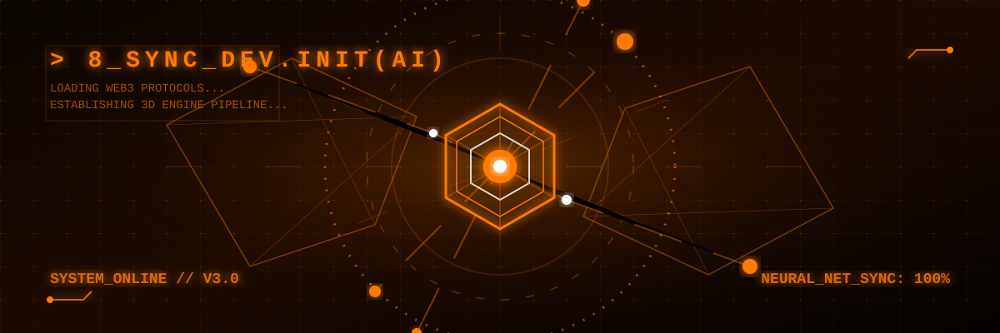

  

  <strong>NVIDIA Inception</strong> · AI developer education and tools · Made in Vietnam

  <a href="https://8syncdev.com">8syncdev.com</a> ·
  <a href="https://www.youtube.com/@Dev8Sync">YouTube @Dev8Sync</a> ·
  <a href="https://github.com/8syncdev">@8syncdev</a>

---

**8 Sync Dev** teaches people to understand code — Learn → Breach → Retain — and ships the tools we wished we had as students.

| Product | What it is |
| --- | --- |
| [8syncdev.com](https://8syncdev.com) | Brand hub |
| [coding.8syncdev.com](https://coding.8syncdev.com) | DSA practice (The Breach) |
| [ZUS](https://zus-web.vercel.app/) | 22 MB AI IDE (Tauri 2 + Rust) |
| [news.8syncdev.com](https://news.8syncdev.com) | AI / engineering news |

Founder: [Nguyễn Phương Anh Tú](https://github.com/8syncdev) (Alex). Org accepted into **NVIDIA Inception** on 2026-08-19.

  
  
  
  

